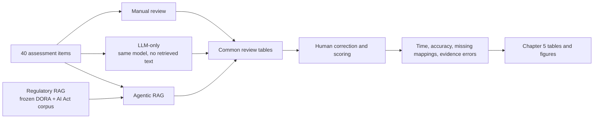
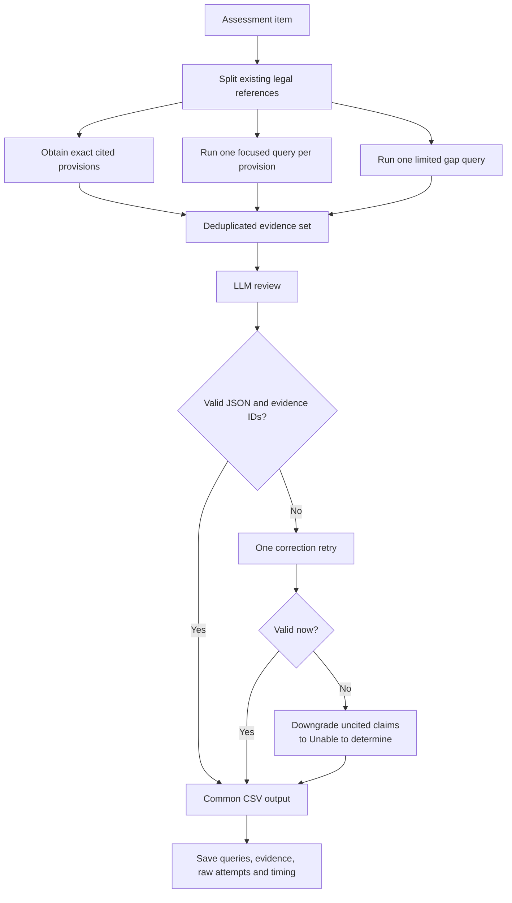

# System Diagram Drafts

These are working diagrams for Chapter 4. Redraw or restyle them before final
submission.

## Overall experiment design

```mermaid
flowchart LR
    D[40 assessment items] --> M[Manual review]
    D --> L[LLM-only<br/>same model, no retrieved text]
    D --> A[Agentic RAG]
    R[Regulatory RAG<br/>frozen DORA + AI Act corpus] --> A
    M --> O[Common review tables]
    L --> O
    A --> O
    O --> H[Human correction and scoring]
    H --> C[Time, accuracy, missing mappings, evidence errors]
    C --> T[Chapter 5 tables and figures]
```

## Agent review workflow

```mermaid
flowchart TD
    I[Assessment item] --> P[Split existing legal references]
    P --> E[Obtain exact cited provisions]
    P --> Q[Run one focused query per provision]
    P --> G[Run one limited gap query]
    E --> V[Deduplicated evidence set]
    Q --> V
    G --> V
    V --> L[LLM review]
    L --> X{Valid JSON and evidence IDs?}
    X -- Yes --> O[Common CSV output]
    X -- No --> Y[One correction retry]
    Y --> Z{Valid now?}
    Z -- Yes --> O
    Z -- No --> U[Downgrade uncited claims<br/>to Unable to determine]
    U --> O
    O --> S[Save queries, evidence, raw attempts and timing]
```
